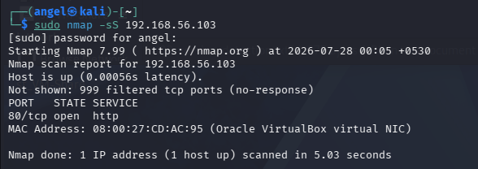
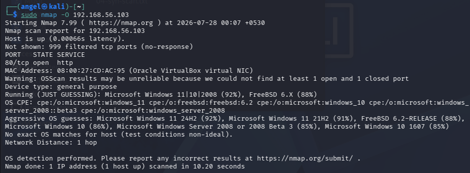
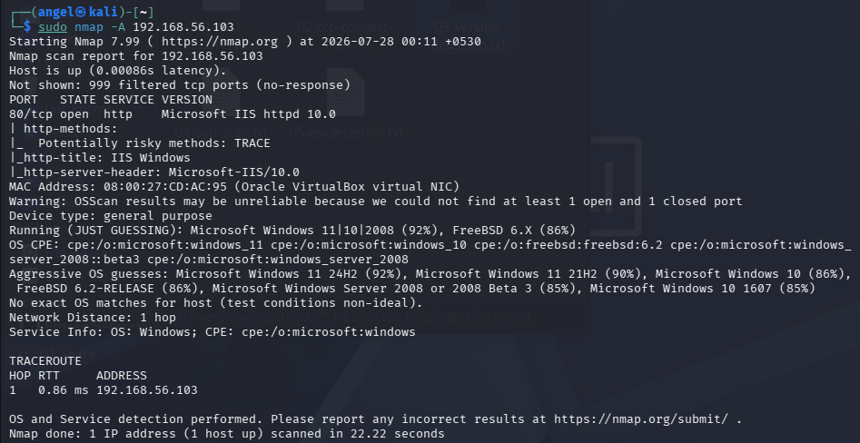
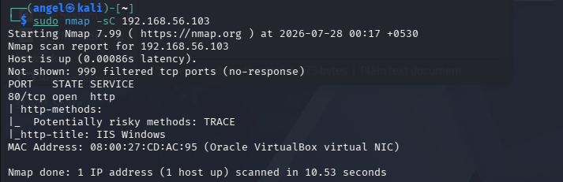
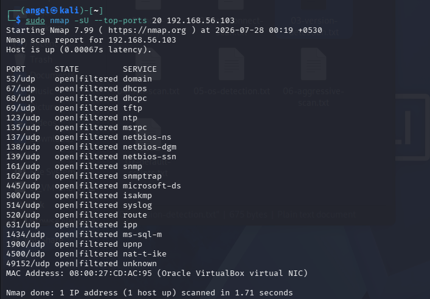

<p align="center">
  
</p>

<h1 align="center">🌐 Nmap Network Scanning</h1>

<p align="center">
Practical Network Discovery, Service Enumeration, and Security Assessment using Nmap
</p>

<p align="center">


</p>

---

# 📖 Overview

This repository demonstrates practical **network reconnaissance and service enumeration** using **Nmap** in a virtual lab environment.

The project covers essential Nmap scan techniques used by penetration testers, network administrators, and Security Operations Center (SOC) analysts to identify live hosts, discover open ports, enumerate services, detect operating systems, and perform basic security assessments.

---
> **Disclaimer**
>
> This project was performed in a controlled virtual lab environment for educational and ethical cybersecurity purposes only. All scans were conducted against systems owned and configured by the author.

# 🎯 Objectives

- Discover active hosts on a network
- Identify open TCP and UDP ports
- Detect running services and versions
- Identify the target operating system
- Perform advanced service enumeration
- Demonstrate the use of Nmap NSE scripts
- Document each scan with screenshots and analysis

---

# 🖥️ Lab Environment

| Component | Details |
|-----------|---------|
| Operating System | Kali Linux |
| Target Machine | Windows 11 |
| Virtualization | Oracle VirtualBox |
| Tool | Nmap 7.99 |
| Network | Host-Only Adapter |

---

# 📂 Repository Structure

```text
nmap-network-scanning/
│
├── README.md
├── LICENSE
├── images/
├── scans/
└── reports/
```

---

# 📑 Scan Summary

| Scan | Status |
|------|--------|
| Host Discovery (-sn) | ✅ |
| TCP Connect Scan (-sT) | ✅ |
| Version Detection (-sV) | ✅ |
| SYN Scan (-sS) | ✅ |
| OS Detection (-O) | ✅ |
| Aggressive Scan (-A) | ✅ |
| NSE Default Scripts (-sC) | ✅ |
| UDP Scan (-sU) | ✅ |

---

# 1️⃣ Host Discovery (-sn)

## 🎯 Objective

Identify active hosts on the local network without scanning ports.

---

## Command

```bash
nmap -sn 192.168.56.103
```

---

## Screenshot

<p align="center">

</p>

<p align="center">
<b>Figure 1:</b> Host Discovery using Nmap Ping Scan.
</p>

---

## Scan Output

- [`scans/01-host-discovery.txt`](scans/01-host-discovery.txt)

---

## Analysis

The scan successfully detected the Windows 11 target host as online.

Nmap confirmed:

- Host is reachable
- Very low network latency
- VirtualBox MAC address identified

Since the `-sn` option disables port scanning, only host discovery was performed.

---

## Security Relevance

Host discovery is commonly used during reconnaissance to:

- Identify live systems
- Verify network connectivity
- Build a network inventory
- Prepare for service enumeration

---

# 2️⃣ TCP Connect Scan (-sT)

## 🎯 Objective

Identify open TCP ports using a complete TCP three-way handshake.

---

## Command

```bash
nmap -sT 192.168.56.103
```

---

## Screenshot

<p align="center">

</p>

<p align="center">
<b>Figure 2:</b> TCP Connect Scan identifying the HTTP service.
</p>

---

## Scan Output

- [`scans/02-tcp-connect-scan.txt`](scans/02-tcp-connect-scan.txt)

---

## Analysis

The TCP Connect Scan successfully identified:

| Item | Result |
|------|--------|
| Open Port | 80/tcp |
| Service | HTTP |

Nmap completed the full TCP three-way handshake before confirming the port as open.

---

## Security Relevance

TCP Connect Scans are commonly used to:

- Discover exposed services
- Identify accessible ports
- Verify firewall behavior
- Support vulnerability assessments

---

# 3️⃣ Service Version Detection (-sV)

## 🎯 Objective

Identify the software and version running on open ports.

---

## Command

```bash
nmap -sV 192.168.56.103
```

---

## Screenshot

<p align="center">

</p>

<p align="center">
<b>Figure 3:</b> Service version detection using Nmap.
</p>

---

## Scan Output

- [`scans/03-version-detection.txt`](scans/03-version-detection.txt)

---

## Analysis

Nmap successfully identified:

| Port | Service | Version |
|------|---------|----------|
| 80/tcp | HTTP | Microsoft IIS httpd 10.0 |

Additional information obtained:

- Operating System Family
- Common Platform Enumeration (CPE)
- Service Fingerprinting

---

## Security Relevance

Version detection helps security professionals:

- Identify outdated software
- Detect vulnerable services
- Support vulnerability assessments
- Prioritize remediation activities

---

# 4️⃣ SYN Scan (-sS)

## 🎯 Objective

Perform a TCP SYN (Half-Open) Scan to identify open TCP ports without completing the full TCP three-way handshake.

---

## Command

```bash
sudo nmap -sS 192.168.56.103
```

---

## Screenshot

<p align="center">

</p>

<p align="center">
<b>Figure 4:</b> TCP SYN Scan using Nmap.
</p>

---

## Scan Output

- [`scans/04-syn-scan.txt`](scans/04-syn-scan.txt)

---

## Analysis

The SYN Scan identified TCP port **80** as open.

Unlike a TCP Connect Scan, SYN Scan performs a half-open handshake by sending a SYN packet and analyzing the response without completing the connection.

---

## Security Relevance

SYN scans are widely used because they are:

- Faster than TCP Connect scans
- Less likely to be logged by some services
- Effective for network reconnaissance
- Commonly used during penetration testing

---

# 5️⃣ Operating System Detection (-O)

## 🎯 Objective

Identify the operating system running on the target host using TCP/IP fingerprinting.

---

## Command

```bash
sudo nmap -O 192.168.56.103
```

---

## Screenshot

<p align="center">

</p>

<p align="center">
<b>Figure 5:</b> Operating System Detection using Nmap.
</p>

---

## Scan Output

- [`scans/05-os-detection.txt`](scans/05-os-detection.txt)

---

## Analysis

Nmap successfully identified the target as a Microsoft Windows operating system with high confidence.

The scan also estimated:

- Device Type
- Operating System Family
- Network Distance
- OS Fingerprint

> **Note:** Nmap displayed a warning that OS detection may be less reliable because it could not identify both an open and a closed TCP port. This is expected in this lab environment where only port 80 was open.

---

## Security Relevance

OS detection enables security analysts to:

- Identify target platforms
- Prioritize vulnerabilities
- Match exploits to operating systems
- Improve asset inventory

---

# 6️⃣ Aggressive Scan (-A)

## 🎯 Objective

Perform advanced service enumeration using Nmap's Aggressive Scan.

---

## Command

```bash
sudo nmap -A 192.168.56.103
```

---

## Screenshot

<p align="center">

</p>

<p align="center">
<b>Figure 6:</b> Aggressive Scan using Nmap.
</p>

---

## Scan Output

- [`scans/06-aggressive-scan.txt`](scans/06-aggressive-scan.txt)

---

## Analysis

The Aggressive Scan performed:

- Service Detection
- Version Detection
- Default NSE Scripts
- OS Detection
- Traceroute

The scan identified:

- Microsoft IIS 10.0
- IIS Windows default page
- HTTP methods
- Operating System fingerprint

---

## Security Relevance

Aggressive Scan provides valuable reconnaissance information by combining multiple detection techniques into a single scan.

---

# 7️⃣ Default NSE Scripts (-sC)

## 🎯 Objective

Execute Nmap's default NSE scripts to gather additional information about services.

---

## Command

```bash
sudo nmap -sC 192.168.56.103
```

---

## Screenshot

<p align="center">

</p>

<p align="center">
<b>Figure 7:</b> Nmap Default NSE Script Scan.
</p>

---

## Scan Output

- [`scans/07-default-scripts.txt`](scans/07-default-scripts.txt)

---

## Analysis

The default NSE scripts discovered:

- IIS Windows Title
- Supported HTTP methods
- HTTP TRACE enabled

These scripts automatically enumerate services without requiring manual interaction.

---

## Security Relevance

NSE scripts assist security professionals by:

- Detecting service configurations
- Identifying weak settings
- Collecting additional reconnaissance information
- Automating common security checks

---

# 8️⃣ UDP Scan (-sU)

## 🎯 Objective

Identify common UDP services running on the target.

---

## Command

```bash
sudo nmap -sU --top-ports 20 192.168.56.103
```

---

## Screenshot

<p align="center">

</p>

<p align="center">
<b>Figure 8:</b> UDP Scan using Nmap.
</p>

---

## Scan Output

- [`scans/08-udp-scan.txt`](scans/08-udp-scan.txt)

---

## Analysis

The UDP scan reported several ports as **open|filtered**.

This result is common because UDP is a connectionless protocol. When a target does not respond, Nmap cannot always determine whether the port is open or being filtered by a firewall.

---

## Security Relevance

UDP scanning helps identify services such as:

- DNS
- DHCP
- SNMP
- TFTP
- NetBIOS

Understanding UDP exposure is important because many critical infrastructure services rely on UDP.

---

# 📊 Scan Comparison

| Scan | Purpose | Result |
|------|---------|--------|
| Host Discovery (`-sn`) | Detect Live Hosts | ✅ Host Found |
| TCP Connect (`-sT`) | Full TCP Handshake | ✅ Port 80 Open |
| SYN Scan (`-sS`) | Half-Open Scan | ✅ Port 80 Open |
| Version Detection (`-sV`) | Service Enumeration | ✅ Microsoft IIS 10.0 |
| OS Detection (`-O`) | Operating System Identification | ✅ Windows Detected |
| Aggressive Scan (`-A`) | Comprehensive Enumeration | ✅ Multiple Results |
| NSE Scripts (`-sC`) | Automated Enumeration | ✅ HTTP Information |
| UDP Scan (`-sU`) | UDP Enumeration | ✅ Open/Filtered UDP Ports |

---

# 🛡️ Skills Demonstrated

- Nmap Host Discovery
- TCP Port Scanning
- SYN Scanning
- UDP Scanning
- Service Enumeration
- Version Detection
- Operating System Fingerprinting
- Network Reconnaissance
- Security Assessment
- Network Enumeration
- NSE Script Execution
- Virtual Lab Configuration

---

# 📚 Key Learnings

Through this project, I gained practical experience in:

- Discovering active hosts on a network
- Identifying open TCP and UDP ports
- Enumerating network services
- Detecting operating systems
- Using Nmap Scripting Engine (NSE)
- Performing security reconnaissance
- Documenting scan results for technical reporting

---

# 🚀 Future Enhancements

Future versions of this project may include:

- Firewall Evasion Techniques
- Idle Scan (`-sI`)
- Fragmentation (`-f`)
- Timing Templates (`-T0` to `-T5`)
- XML Report Generation
- Zenmap Integration
- IPv6 Scanning
- NSE Vulnerability Scripts
- Multi-Host Scanning
- Network Mapping

---

# 📖 Conclusion

This project demonstrates practical network reconnaissance and service enumeration using **Nmap** in a controlled virtual lab environment.

By performing host discovery, TCP and UDP scanning, service enumeration, operating system detection, and NSE scripting, this project highlights the techniques commonly used by penetration testers, security analysts, and SOC teams during security assessments.

The hands-on experience gained through this lab strengthens foundational skills in network security, vulnerability assessment, and cybersecurity investigations.

---

## 👨‍💻 Author

**Jaison Jerald**

- 💼 Cybersecurity Enthusiast
- 🛡️ EC-Council Certified Ethical Hacker (CEH)
- 🌐 GitHub: https://github.com/jaisonjerald

If you found this project useful, consider ⭐ starring the repository.
