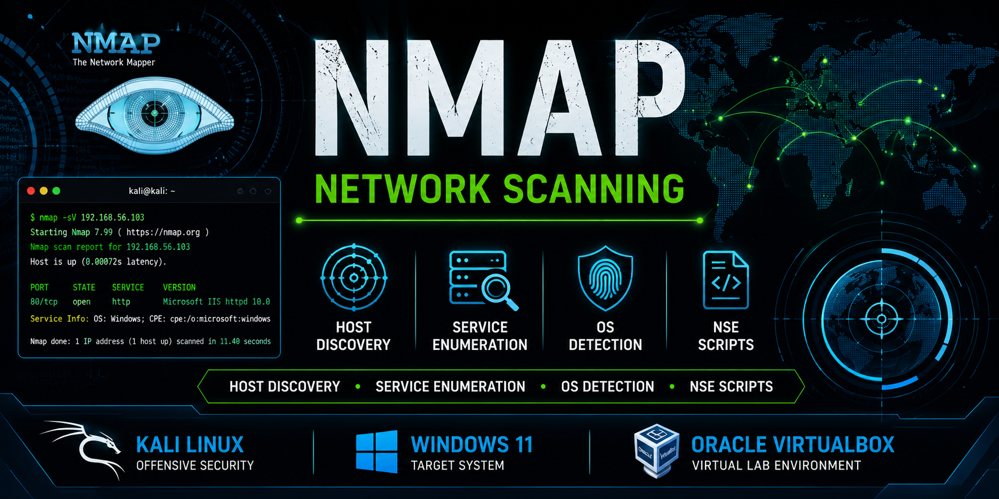
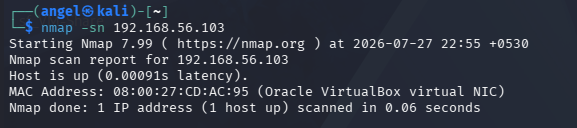
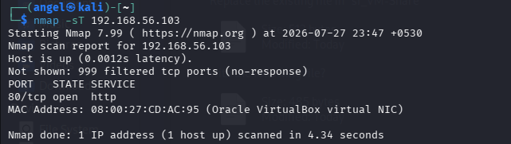
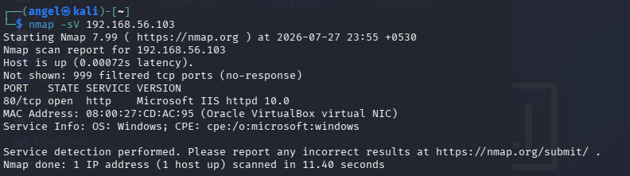

<p align="center">
  
</p>

<h1 align="center">🌐 Nmap Network Scanning</h1>

<p align="center">
Practical Network Discovery, Service Enumeration, and Security Assessment using Nmap
</p>

<p align="center">


</p>

---

# 📖 Overview

This repository demonstrates practical **network reconnaissance and service enumeration** using **Nmap** in a virtual lab environment.

The project covers essential Nmap scan techniques used by penetration testers, network administrators, and Security Operations Center (SOC) analysts to identify live hosts, discover open ports, enumerate services, detect operating systems, and perform basic security assessments.

---

# 🎯 Objectives

- Discover active hosts on a network
- Identify open TCP and UDP ports
- Detect running services and versions
- Identify the target operating system
- Perform advanced service enumeration
- Demonstrate the use of Nmap NSE scripts
- Document each scan with screenshots and analysis

---

# 🖥️ Lab Environment

| Component | Details |
|-----------|---------|
| Operating System | Kali Linux |
| Target Machine | Windows 11 |
| Virtualization | Oracle VirtualBox |
| Tool | Nmap 7.99 |
| Network | Host-Only Adapter |

---

# 📂 Repository Structure

```text
nmap-network-scanning/
│
├── README.md
├── LICENSE
├── images/
├── scans/
└── reports/
```

---

# 📑 Scan Summary

| Scan | Status |
|------|--------|
| Host Discovery (-sn) | ✅ |
| TCP Connect Scan (-sT) | ✅ |
| Version Detection (-sV) | ✅ |
| SYN Scan (-sS) | ✅ |
| OS Detection (-O) | ✅ |
| Aggressive Scan (-A) | ✅ |
| NSE Default Scripts (-sC) | ✅ |
| UDP Scan (-sU) | ✅ |

---

# 1️⃣ Host Discovery (-sn)

## 🎯 Objective

Identify active hosts on the local network without scanning ports.

---

## Command

```bash
nmap -sn 192.168.56.103
```

---

## Screenshot

<p align="center">

</p>

<p align="center">
<b>Figure 1:</b> Host Discovery using Nmap Ping Scan.
</p>

---

## Scan Output

- [`scans/01-host-discovery.txt`](scans/01-host-discovery.txt)

---

## Analysis

The scan successfully detected the Windows 11 target host as online.

Nmap confirmed:

- Host is reachable
- Very low network latency
- VirtualBox MAC address identified

Since the `-sn` option disables port scanning, only host discovery was performed.

---

## Security Relevance

Host discovery is commonly used during reconnaissance to:

- Identify live systems
- Verify network connectivity
- Build a network inventory
- Prepare for service enumeration

---

# 2️⃣ TCP Connect Scan (-sT)

## 🎯 Objective

Identify open TCP ports using a complete TCP three-way handshake.

---

## Command

```bash
nmap -sT 192.168.56.103
```

---

## Screenshot

<p align="center">

</p>

<p align="center">
<b>Figure 2:</b> TCP Connect Scan identifying the HTTP service.
</p>

---

## Scan Output

- [`scans/02-tcp-connect-scan.txt`](scans/02-tcp-connect-scan.txt)

---

## Analysis

The TCP Connect Scan successfully identified:

| Item | Result |
|------|--------|
| Open Port | 80/tcp |
| Service | HTTP |

Nmap completed the full TCP three-way handshake before confirming the port as open.

---

## Security Relevance

TCP Connect Scans are commonly used to:

- Discover exposed services
- Identify accessible ports
- Verify firewall behavior
- Support vulnerability assessments

---

# 3️⃣ Service Version Detection (-sV)

## 🎯 Objective

Identify the software and version running on open ports.

---

## Command

```bash
nmap -sV 192.168.56.103
```

---

## Screenshot

<p align="center">

</p>

<p align="center">
<b>Figure 3:</b> Service version detection using Nmap.
</p>

---

## Scan Output

- [`scans/03-version-detection.txt`](scans/03-version-detection.txt)

---

## Analysis

Nmap successfully identified:

| Port | Service | Version |
|------|---------|----------|
| 80/tcp | HTTP | Microsoft IIS httpd 10.0 |

Additional information obtained:

- Operating System Family
- Common Platform Enumeration (CPE)
- Service Fingerprinting

---

## Security Relevance

Version detection helps security professionals:

- Identify outdated software
- Detect vulnerable services
- Support vulnerability assessments
- Prioritize remediation activities

---

**➡️ End of Part 1**
